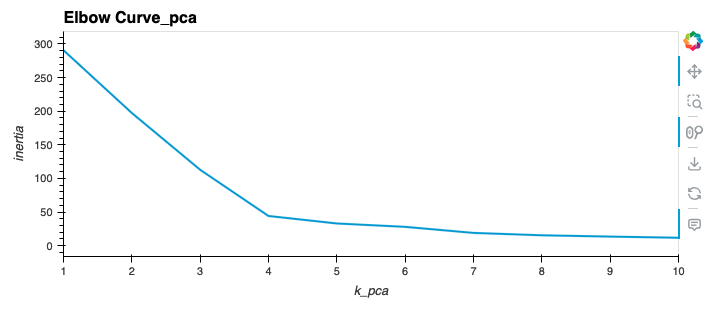
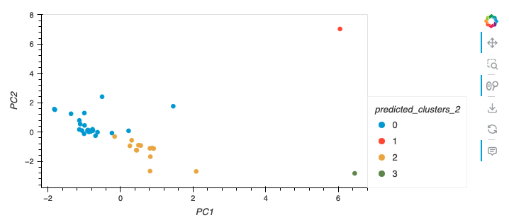

# CryptoClustering
In this challenge, the knowledge of Python and unsupervised learning was applied to predict if cryptocurrencies are affected by 24-hour or 7-day price changes.

Instructions

The file of crypto_market_data.csv was loaded into a DataFrame in the file Crypto_Clustering_starter_code.ipynb by using the Pandas library.

The summary statistics was checked to see what the data looks like before proceeding.

Prepare the Data
The StandardScaler() module from scikit-learn was used to normalize the data from the CSV file.

Part 1: Elbow curve and clustering with k-means for the original data

A DataFrame with the scaled data was created and the "coin_id" index from the original DataFrame was set as the index for the new DataFrame.

The elbow method was used to find the best value for k based on the original scaled DataFrame:

The best value for k was found to be 4.

A scatter plot using hvPlot was created:

part 2: The clusters was optimized with Principal Component Analysis

A PCA was perform to reduce the features to three principal components from the original DataFrame.

Retrieve the explained variance to determine how much information can be attributed to each principal component and then answer the following question in your notebook:

The total explained variance of the three principal components is shown as folloing: 

Create a new DataFrame with the PCA data and set the "coin_id" index from the original DataFrame as the index for the new DataFrame.

Elbow curve for PCA DataFrame is shown as following:

The best k value remains 4. 

A scatter hvplot was created based on the PCA data: 

Conclusion 

The best k value remains the same after performing PCA 

The clusters were reduced and became easier to visualize after performing PCA

